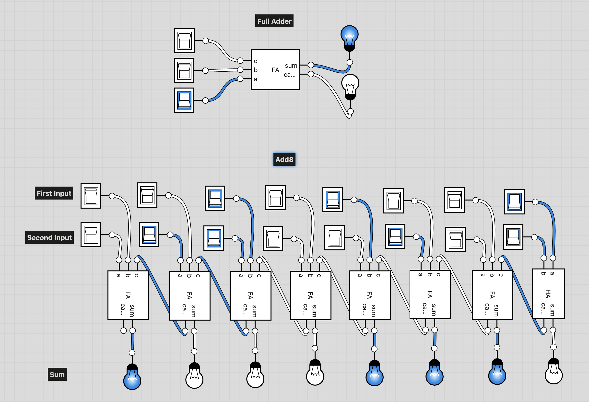

# nand2tetris
I'm going through the Nand2Tetris course to get a better understanding of how the computer works. As a child, I had an old hand me down [electronics set](https://artsandculture.google.com/asset/play-set-educational-toy-100-in-1-electronic-project-kit-science-fair-radio-shack/IQEKIRax3CMwEA), it was my favorite toy. In it you could build NAND, NOT, OR, AND, and XOR gates, but unlike say building a radio or a light detector, I didn't understand why we were building the gates.

Later in elementary school we did a little programming, doing things like making a multiplication table. In high school, we learned the basics of programming, where our projects were more geared towards math, like plotting functions in 3D. I didn't have access to a real computer at home, but occasionally I'd get to program things over at my with a friends' house. I tried to make a copy of space invaders, but without the knowdledge of a game loop, the game ended after you shot the first ship. Along the way, we'd [PEEK and POKE](https://en.wikipedia.org/wiki/PEEK_and_POKE) at memory. In college, I'd then try to squeeze in computer science courses.

After years of being a scientist, mainly determining the structures of proteins using the uncanny art of [X-ray crystallography](https://en.wikipedia.org/wiki/X-ray_crystallography) (a combination of experimental data and computation), I've worked on or built automated systems for protein structure determination, visualization, and analysis along with a few bioinformatics tools. This lead to some web-based applications for structural analysis of proteins, and now I've slowly morphed into a full-stack developer.

I'm hoping that through this course, I can bridge the gaps between the gates I built as a little kid, accessing memory registers, and programming. I'm doing this for personal education, as well as fun, along with my coding/mathematician buddies [Josh](https://github.com/j127) and [Dan](https://github.com/philomathdan/Nand2Tetris)

In this course, we are provided with a [hardware simulator](https://www.nand2tetris.org/software), and start with a given NAND gate and work our way through the abstracted computer heirarchy. Going from basic gates like those listed above, to multiplexors/demultiplexors then multi-bit and multi-way versions. From there, Adders and an incrementer are built, then an ALU, registers and RAM (via another given Digital Flip-Flop gate), to a CPU called Hack. On the software side, we will go through machine language, assembly, and then build a higher level language called Jack.

The book I'm using is the 2nd edition of "[The Elements of Computing Systems](https://mitpress.mit.edu/books/elements-computing-systems-second-edition)" by Nisan and Schocken.

The tools (hardware simulators and the like) can be found at the [nand2tetris website](https://www.nand2tetris.org/).

Here's an example diagram of thing we get to build. This is an Add8 Chip.

