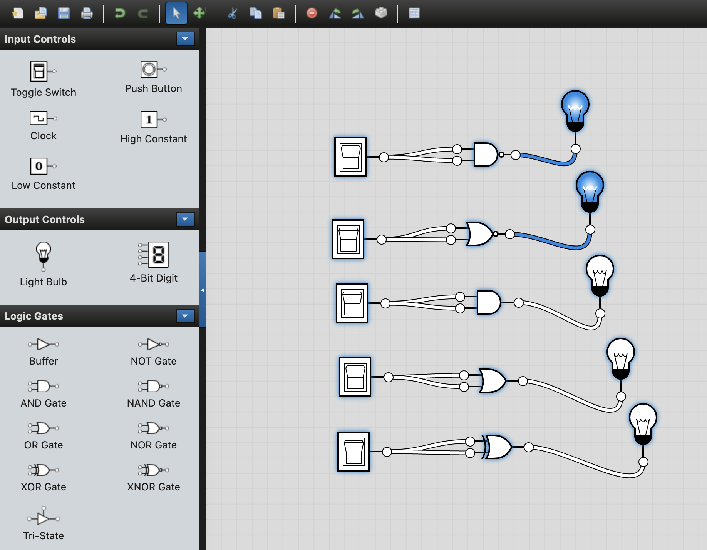
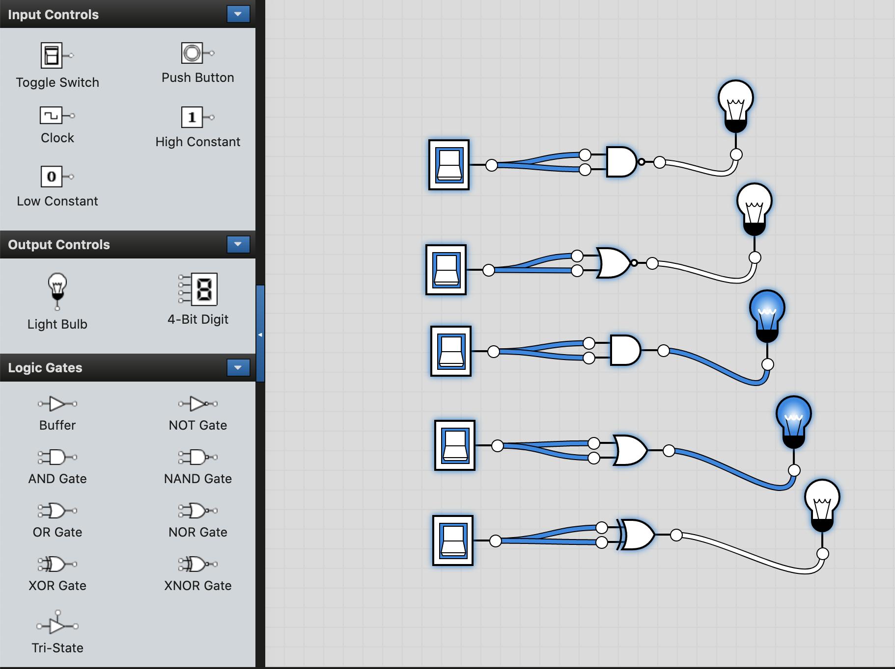

# NOT Definitions:
- Book: `if in==0 then out=1, else out=0`
- Chip: `out = not in`

## Derive a formula for above for Not
- From table 1.2 If X then Y means: `xbar + y`, so
- `xbar + y`, then if we have 2 inputs, we must make y into x:
- `xbar + x`, which means:
- `Not(X) Or X`

## Derive a formula from Nand that may give above from 2 inputs
Nand is `(x and y)bar`
- `Not(X And Y)`, so in this case where X and Y must be equal it is:
- `Not(NotX And NotX)`, by de Morgan law:
- `Not(NotX) Or Not(NotX)`, by double negation of the second term:
- `Not(X) Or X`, and that is equivalent to what we have above

## Make a truth table to see what we want
| X | X | Want |
| - | - | ---- |
| 0 | 0 | 1    |
| 1 | 1 | 0    |

### Attempt 1
Solving for 1's we'd have: `Not(X) And Not(X)`, so start there:
- `Not(X) And Not(X)`, by Idempotent law we have:
- `Not(X)`, lol, that doesn't help us get to Nand, that's the Not definition

### Attempt 2
We ended up with the definition of Not last time, so start over:
- `Not(X) And Not(X)`, but actually, from the table above, we could start with:
- `Not(X) Or Not(X)`, and then by de Morgan's law get back to Nand:
- `Not(X And X)`, which is
- `(x and x)bar` - the definition of Nand in this case with double X inputs.
- ie. `(x and x)bar` vs. the Nand definition `(x and y)bar`
- **Done** - This chip is saved as `Not.hdl`

### Prove it also works with Nor
- Go back to `Not(X) And Not(X)` and start over, so:
- `Not(X) And Not(X)`, then de Morgan's law:
- `Not(X Or X)`, which is Nor with double inputs:
- `(x or x)bar` - the definition of Nor in this case with double X inputs.
- ie. `(x or x)bar` vs. the Nor definition `(x or y)bar`

## Truth table to test
Let's just make a double X truth table for Nand, and for grins, see what other simple gates would work:

| X | X | NAND | NOR | And | Or | XOR |
| - | - | ---- | --- | --- | -- | --- |
| 0 | 0 | 1    | 1   | 0  | 0   | 0   |
| 1 | 1 | 0    | 0   | 1  | 1   | 0   |

Can see double inputs of X into either `Nand` or `Nor` would work. The following two images show connecting a single switch in the `Off` and the `On` states, respectively, followed by the chips in the table above, and the results. Can see again, the most simple way to get Not is via a double connection to Nand or Nor.

### Not with Switch "Off"

### Not with Switch "On"

- Images generated using [logicly](https://logic.ly/demo/), a great product for basic chips

- `Not.hdl_old` is a really old hack job I did previously
