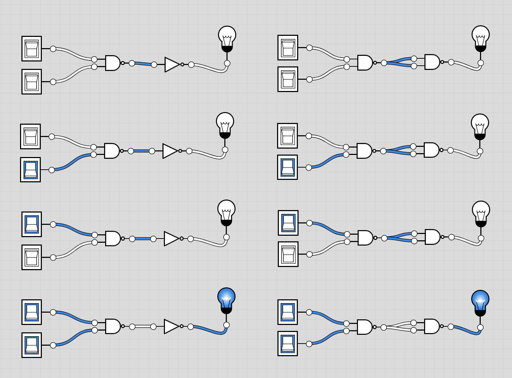

# AND Definitions:
- Book: `out = 1 if (a == 1 and b == 1), else 0`
- Chip:
```
out = 1 if (a == 1 and b == 1)
      0 otherwise
```
## Derive a formula for And from description above
`If (a==1 and b==1) then 1, else 0`, which is the same for the synthesis from the truth table, so:
`X and Y`, double negation
`Not(NotX) and Not(NotY)`, de Morgan
`Not(NotX or NotY)`,

- We want `X and Y`, and since we have just 2 chips, `Not` and `Nand`, where these are:
```
Nand(X,Y) == (x and y)bar == Not(X And Y)
Not(in)
```
- We whould be able to combine `Not(X And Y)` and `Not(in)`:
- `Not(Not(X and Y))`, then by double negation, we would get And:
- `X and Y`
- **Done** - This chip is saved as `And.hdl`

## Extra
- Since Not is derived from Nand, made an all Nand version saved as `AndAllNand.hdl`

## And gate example
- The 4 input states run from top to bottom with inputs [00, 01, 10, 11]
- Left side: `And` gate implemented with `Nand` and `Not`
- Right side: `And` gate implemented with `Nand` and `Nand`



- `And.hdl_old` is a really old hack job I did previously
