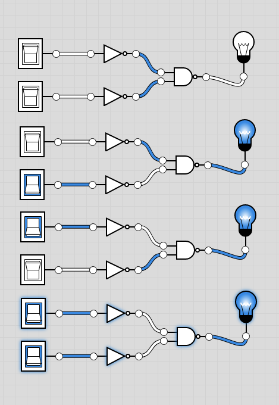

# OR Definitions:
- Book: `if (a == 1 or b == 1) then 1, else 0`
- Chip:
```
out = 1 if (a == 1 or b == 1)
      0 otherwise
```
## Derive from Truth Table:
| X | Y | Want |
| - | - | ---- |
| 0 | 0 | 0    |
| 0 | 1 | 1    |
| 1 | 0 | 1    |
| 1 | 1 | 1    |

## We have the following available:
- `Nand`
- `Not`
- `And`
- and we are looking for `Or`, so let's study the truth tables for only those:


| Func  | Var |   |   |   |  |
| ----- | --- | - | - | - | - |
|  | X | 0 | 0 | 1 | 1 |
|  | Y | 0 | 1 | 0 | 1 |
|  |  |  |  |  |  |
| Nand | Not(X And Y) | 1 | 1 | 1 | 0 |
| Not x | Not(X) | 1 | 1 | 0 | 0 |
| Not y | Not(Y) | 1 | 0 | 1 | 0 |
| And | X And Y | 0 | 0 | 0 | 1 |
| Or | X Or Y | 0 | 1 | 1 | 1 |

- Appears we just have to make Nand flip it's outputs for the [00] and [11] cases, to do that, we can negate the input before it get's there with not... so:
- `Not(X) Nand Not(Y)` or
- `Nand(NotX, NotY)`
- **Done** File is `Or.hdl`

## Or gate image
- Shows the 4 input states [00,01,10,11] from top to bottom



- `Or.hdl_old` is a really old hack job I did previously
