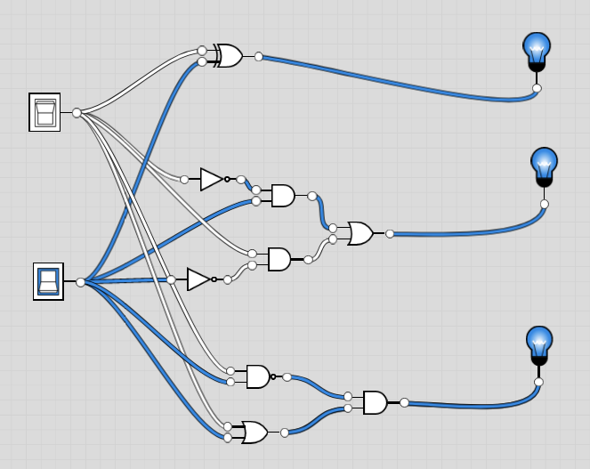

## XOR Definitions:
- Book: `if (a!=b) then out=1, else out=0`
- Chip:
```
Exclusive-or gate:
out = not (a == b)
```
- Table 1.2: `X And Not(Y) Or Not(X) And Y`

## Truth table Synthesis
| X | Y | Xor |
| - | - | --- |
| 0 | 0 | 0   |
| 0 | 1 | 1   |
| 1 | 0 | 1   |
| 1 | 1 | 0   |

## Truth table synthesis / Table 1.2 definition / Dan's "Say it out loud approach"
| X | Y | Xor |
| - | - | --- |
| 0 | 0 | 0   |
| 0 | 1 | 1   |
| 1 | 0 | 1   |
| 1 | 1 | 0   |

# Table synthesis
`Not(X) And Y Or X and Not(Y)`

# Table 1.2 definition
`X And Not(Y) Or Not(X) And Y`

# Dan's method
- If `X == Y` then output 0, but we want cases with 1, so:
- If `X != Y` then output 1, so build it all out:
If `Not(X) and Y` output 1 OR If `Not(Y) and X` output 1

All seem basically equivalent, so built:
`Not(X) And Y Or X and Not(Y)`
- **Done** - This one is saved ad `XorDef.hdl`

## From the Chip definition
- Not(X equivalent Y), Expand equivalent expression, where equivalence is:
- 
| Func  | Var |   |   |   |  |
| ----- | --- | - | - | - | - |
|  | X | 0 | 0 | 1 | 1 |
|  | Y | 0 | 1 | 0 | 1 |
|  |  |  |  |  |  |
| Equivalence | X And Y Or Not(X) And Not(Y) | 1 | 0 | 0 | 1 |

- `Not(X And Y Or Not(X) And Not(Y))`, De Morgan right side:
- `Not([X And Y] Or [Not(X Or Y)])`, De Morgan around "Or":
- `Not[X And Y] And Not[Not(X or Y])`, Double negate right:
- `Not[X And Y] And (X Or Y)`, Nand the left:
- `Nand(X,Y) And (X Or Y)`
- **Done** - This one is saved as `Xor.hdl`

## Image
- At the top, there is the XOR gate
- Middle is the table synthesis/definition and Dan approach
- Bottom is the chip definition approach


