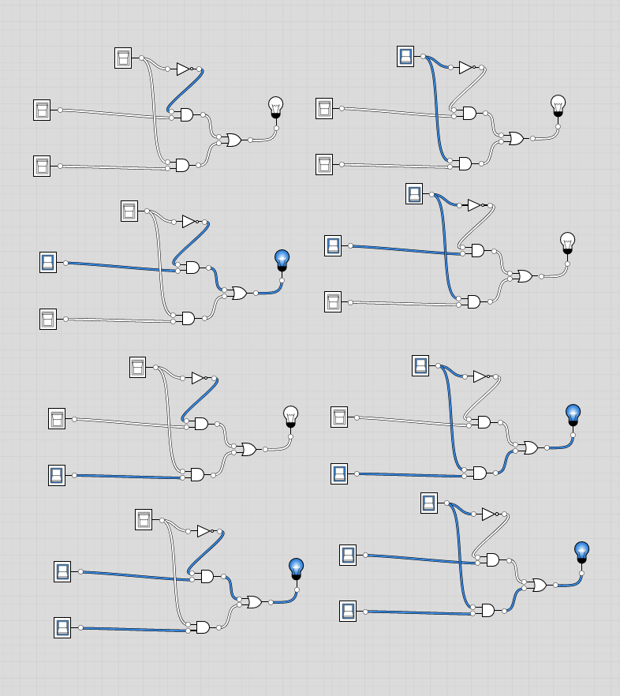

# Mux Definition:
- Chip:
```
Multiplexor:
out = a if sel == 0
      b otherwise
```

## Truth table synthesis:
| A | B | S | Out | Terms |
| - | - | - | - | - |
| 0 | 0 | 0 | 0 ||
| 1 | 0 | 0 | 1 | A and Not(S) => A |
| 0 | 0 | 1 | 0 ||
| 0 | 1 | 1 | 1 | B and S => B |

- Boils down to:
  - If A and Not(S) then out
  - If B and S then out
- Here, since they said "otherwise", I took it as "Or", therefore, I took these separately:
  - `A and Not(S)`
  - `B and S`
- Then did: `A and Not(S) Or B and S`
- **Done** - file is Mux.hdl

## Image:

- Here, the Selector or `S` is the switch at the top in each of the 8 representations, `A` and `B` are far to the left to make it obvious, and `A` is on top, `B` is on bottom.
- Left: Selector is in the `off` state
- Right: Selector is in the `on` state
- Then we flip A and B as [00,01,10,11]



- Besides the old `Mux.hdl_old` file, I have one called `MuxDan3.hdl`, but lost my notes on it, still passes though.
