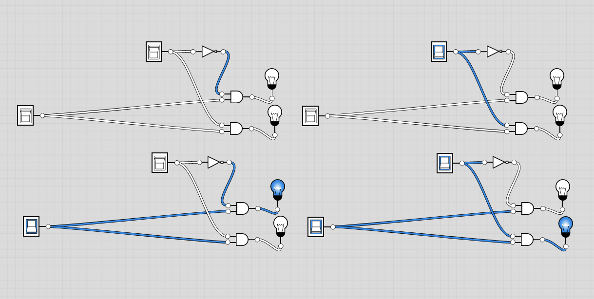

# Dmux Definitions:
```
Demultiplexor:
{a, b} = {in, 0} if sel == 0
         {0, in} if sel == 1
```

- It boils down to:
  - If sel=0 and In, then a
  - If sel=1 and In, then b

## Truth table synthesis:
| S | In | A | B | Terms |
| - | -  | - | - | - |
| 0 | 0  | 0 | 0 ||
| 0 | 1  | 1 | 0 | NotS and In => A |
| 1 | 0  | 0 | 0 ||
| 1 | 1  | 0 | 1 | S and In => B |

- If `Not(S) And In` then `A` **also**  If `S AND In` then `B`
  - I added `also` here, because after many tries at synthesizing this, I figured, maybe they have to be done separately... So built the following:
    - `Not(S) And In` => `A`
    - `S AND In` => `B`
  - where `S` and `In` fan out to each piece...
- **Done** - File is `Dmux.hdl`

## Image
- Here, the Selector or `S` is the switch at the top in each of the 4 representations, the `In` is far to the left to make it obvious
- Left: Selector is in the `off` state
- Right: Selector is in the `on` state
- Top: In is `off`
- Bottom: In is `on`


