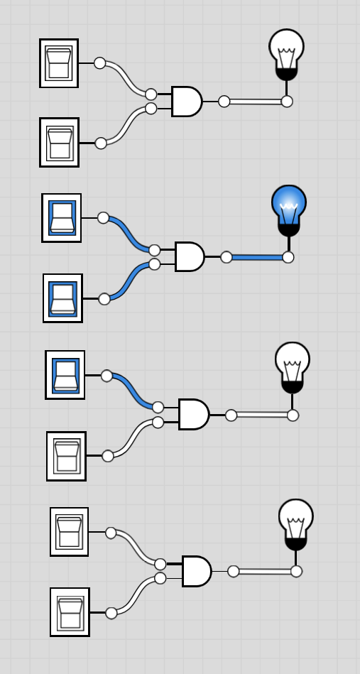

# 16-bit Definitions:
- Here, we just want to make 16 bit versions of `Not`, `And`, `Or`, `Mux`. Basically, you want to do:
- Not: `Not` the following: `for i=0..15: out[i] = not in[i]`
- And and Or: `And`/`O`r the following:`for i=0..15: out[i] = not in[i]`
- Mux: `Mux` the following:
```
for i = 0..15 out[i] = a[i] if sel == 0
                       b[i] if sel == 1
```

## Implementation:
- Basically, specify each pin separately, and then use the gate that was designed previously. Not much more than that.
- See corresponding `Not16.hdl`, `And16.hdl`, `Or16.hdl`, and `Mux16.hdl` files.

## Image
- Example of a 4bit And gate. The implementations for the class are 16-bit, but you get the message


