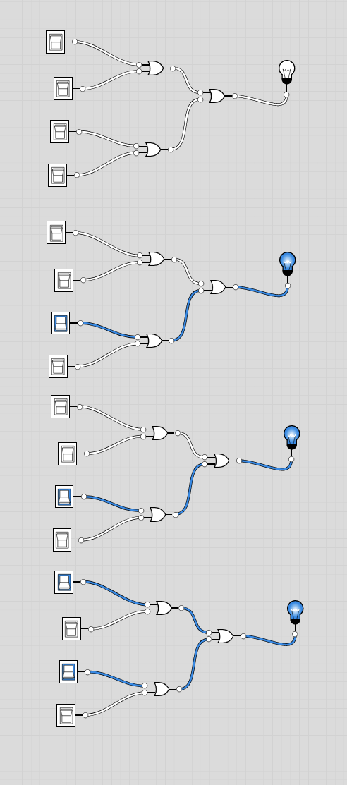

# 8-way Or Definition:
- Chip:
```
8-way Or:
out = (in[0] or in[1] or ... or in[7])
```

## Implementation
- Here we want to return 1 if any of the 8 inputs is `on`, 0 otherwise, so, we can just nest `Or` chips

- **Done** - File is  `Or8way.hdl`

## Image
- Can see we just feed the `Or` gates into each other
- In the diagram, in the top, had everything off, then randomly show how throwing 1 switch or more turns the light on.


