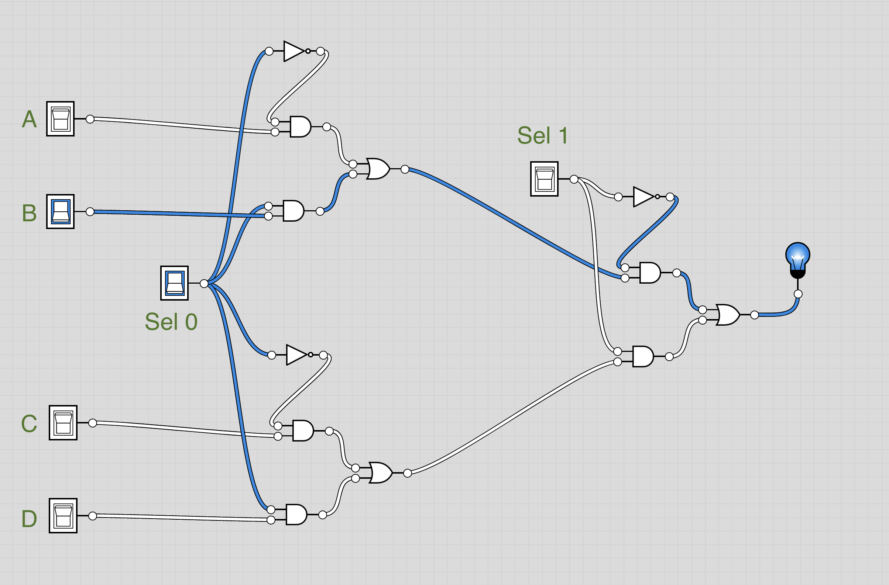
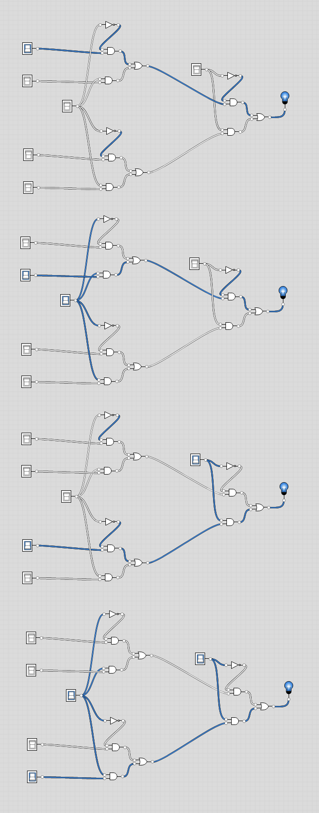

# Mux Multi-way/Multi-bit
Here, we will show solutions for all of the Mux Multi-way Multi-bit gates

##  Mux4Way16 Definition:
```
4-way 16-bit multiplexor:
out = a if sel == 00
      b if sel == 01
      c if sel == 10
      d if sel == 11
```

## Approach
- Here, the approach was to use two `Mux16` gates, then have their outputs become the inputs of a third `Mux16` gate.
- **Done** - File is `Mux4Way16.hdl`

## Image
- Here, I have labeled the inputs a, b, c, d (except in caps), and the two selectors.
- Left: The first two `Mux` gates
- Right: The `Mux` gate that performs the Sel 1 function
- Now, just imagine there are 16 sets of these to make it 16 bit



## Image
- Example of how you need to set the inputs and selectors to get the light bulb to light.



##  Mux4Way16 Definition:
```
 8-way 16-bit multiplexor:
 out = a if sel == 000
       b if sel == 001
       etc.
       h if sel == 111
```

## Approach
- Repeat what was done above, except have two `Mux4Way16` gates to start with and a `Mux16` gate to join them
- **Done** - File is `Mux8Way16.hdl`

## Image
- Didn't make an image for this one because it would be very small, but you should get the idea, it would be similar to above images, but Mux4Way gates would be on the left.
