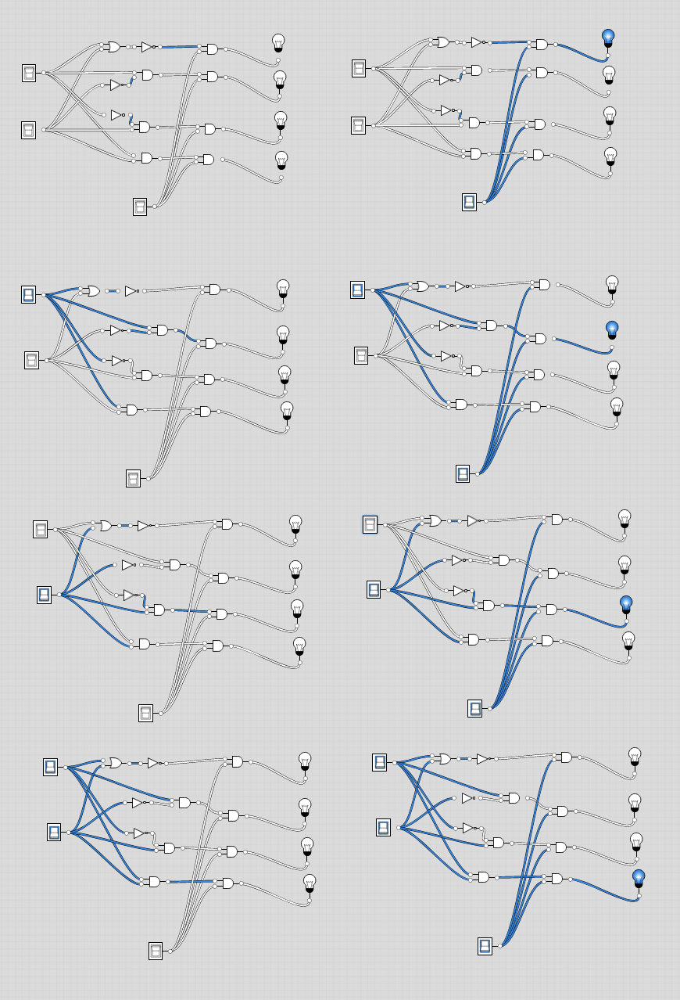

#  DMux4Way Definition:
- Chip:
```
4-way demultiplexor:
{a, b, c, d} = {in, 0, 0, 0} if sel == 00
               {0, in, 0, 0} if sel == 01
               {0, 0, in, 0} if sel == 10
               {0, 0, 0, in} if sel == 11
```

## Had 2 ideas:
- Using the truth tables
- Stack `DMux` gates like done for `Or8Way`

## Approach using truth tables
- If we substitute X and Y for Sel1 and Sel2, we can use the following gates to give a single outcome...ie for {X,Y} == {0,0} == {sel00}, we would use the `Nor` gate.  Then for sel01, we'duse the `Not x and y` gate... basically start at the bottom with `Nor` and keep fanning out the selectors to each of the gates below, marching upward each time.
- Then we can tie the `in` with each output of those with an `And` gate

| Func  | Var          |   |   |   |   |
|-------|--------------|---|---|---|---|
|      | X             | 0 | 0 | 1 | 1 |
|      | Y             | 0 | 1 | 0 | 1 |
||||||
| And         | X And Y      | 0 | 0 | 0 | 1 |
| x And Not y | Not(Y)       | 0 | 0 | 1 | 0 |
| Not x and y | Not(X) And Y | 0 | 1 | 0 | 0 |
| Nor         | Not(X Or Y)  | 1 | 0 | 0 | 0 |

- **Done** - File is `DMux4way.hdl`

## Image
- `selX` is on top, followed by `selY`, `in` is on the bottom
- Left: `in` is turned `off`
- Right: `out` is turned `on`
- Top to bottom, we flip the Selectors such that we have [00,10,01,11], got the middle switched around in the picture, but it's ok. Will flip it later.



## Approach by stacking Mux gates
- Haven't implemented yet, going to move on, but will use this idea for the `DMux8way` chip - Use a combination of the `DMux` and `DMux4Way`
