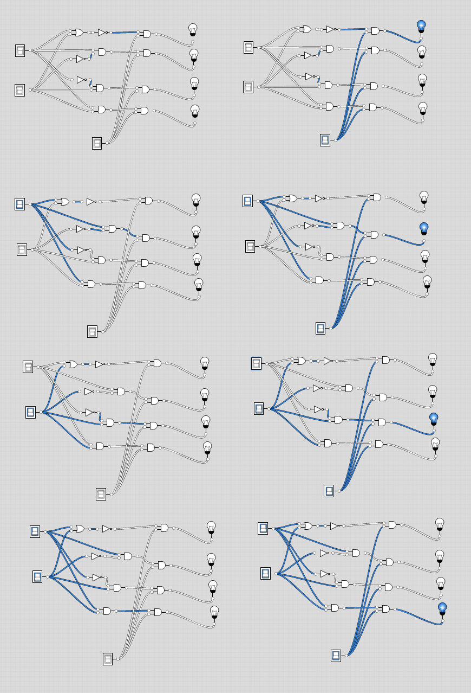
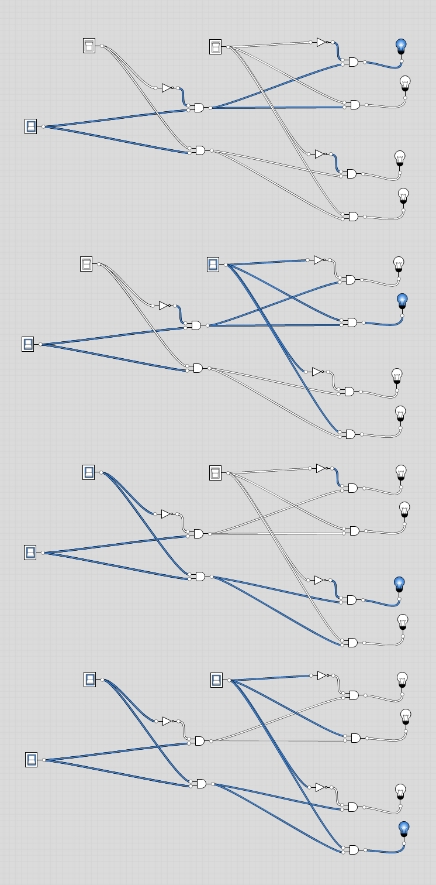
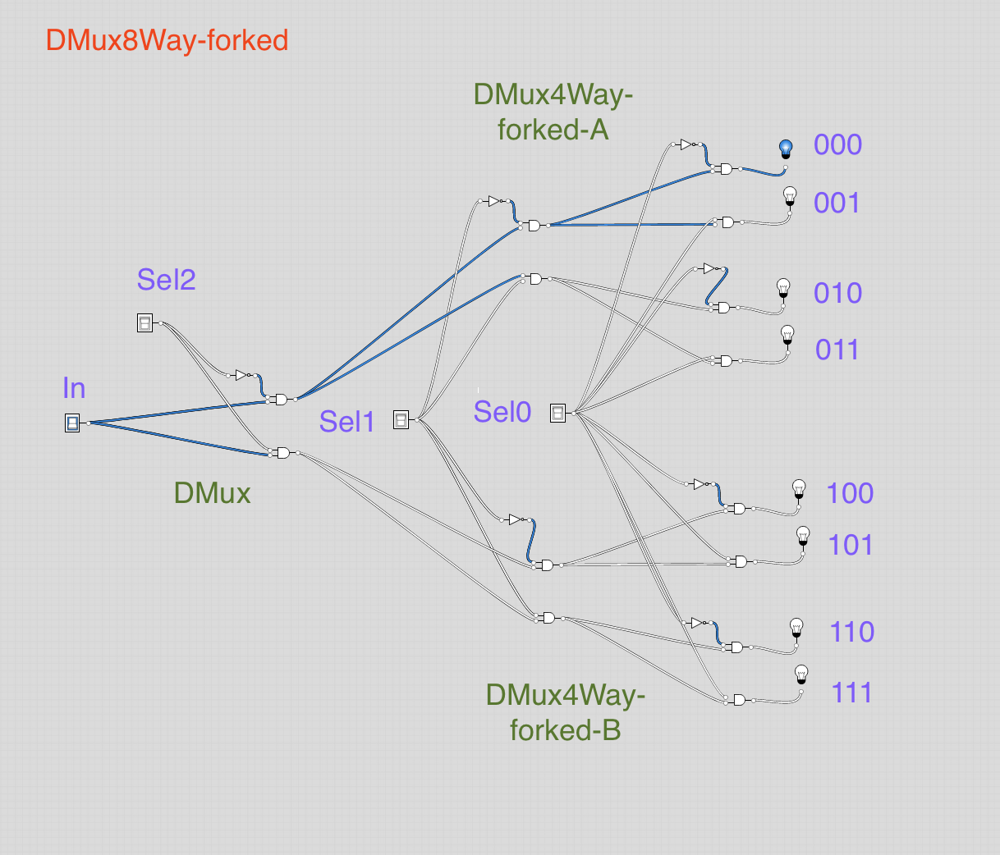

# DMux Multi-way/Multi-bit
Here, we will show solutions for all of the DMux Multi-way/Multi-bit gates

##  DMux4Way Definition:
- Chip:
```
4-way demultiplexor:
{a, b, c, d} = {in, 0, 0, 0} if sel == 00
               {0, in, 0, 0} if sel == 01
               {0, 0, in, 0} if sel == 10
               {0, 0, 0, in} if sel == 11
```

## Had 2 ideas:
- Using the truth tables
- Fork `DMux` gates like done for `Or8Way`

## Approach using truth tables
- If we substitute X and Y for Sel1 and Sel2, we can use the following gates to give a single outcome...ie for {X,Y} == {0,0} == {sel00}, we would use the `Nor` gate.  Then for sel01, we'duse the `Not x and y` gate... basically start at the bottom with `Nor` and keep fanning out the selectors to each of the gates below, marching upward each time.
- Then we can tie the `in` with each output of those with an `And` gate

| Func  | Var          |   |   |   |   |
|-------|--------------|---|---|---|---|
|      | X             | 0 | 0 | 1 | 1 |
|      | Y             | 0 | 1 | 0 | 1 |
||||||
| And         | X And Y      | 0 | 0 | 0 | 1 |
| x And Not y | Not(Y)       | 0 | 0 | 1 | 0 |
| Not x and y | Not(X) And Y | 0 | 1 | 0 | 0 |
| Nor         | Not(X Or Y)  | 1 | 0 | 0 | 0 |

- **Done** - File is `DMux4way.hdl`

## Image
- `selX` is on top, followed by `selY`, `in` is on the bottom
- Left: `in` is turned `off`
- Right: `out` is turned `on`
- Top to bottom, we flip the Selectors such that we have [00,01,10,11]. Note, here the first selector is below the second one.



## Approach by forking Mux gates
- Here, we set up two DMux gates where they share a common selector
- Then use another DMux gate as a selector between them, where it's two outputs become the input for the first two gates
- File is `DMux4WayForked.hdl`

## Image
- Here, I only show examples where the input is "on", which is on the far left, as all bulbs would be "off" otherwise
- Top to bottom: select the other selectors such that each is flipped as [00,01,10,11]. This time the first selector is on the top right, and the second one the top left



##  DMux8Way Definition:
```
8-way demultiplexor:
{a, b, c, d, e, f, g, h} = {in, 0, 0, 0, 0, 0, 0, 0} if sel == 000
                           {0, in, 0, 0, 0, 0, 0, 0} if sel == 001
                           etc.
                           {0, 0, 0, 0, 0, 0, 0, in} if sel == 111
```

## Approach
As done with the second DMux4wayForked solution, I decided to just add yet another `DMux` gate to add in yet another selector between two `DMux4way` gates.
- I tried this using both solutions to the `DMux4way` gates, ie. used `DMux4way.hdl` and `DMux4WayForked.hdl` as the pair of chips that would take input from the output of a single `DMux` gate.
- **Done** - Files are `DMux8way.hdl` and `DMux8WayForked.hdl`
- Note, prior to this, I did not realize that the test files would overwrite what file was selected as the script file if one were loaded, so I made new .tst and .cmp files for the "Forked" versions.

## Image
Since the idea of adding another fork is the same, I'm only showing the `DMux8WayForked.hdl` version. This one obviously would use less chips. Here, I labeled the different chips and selectors, and show a single scenario. It should be obvious, after a lot of staring and comparison to the above image, that by now following the wires that are "hot" or "on" that it works.


