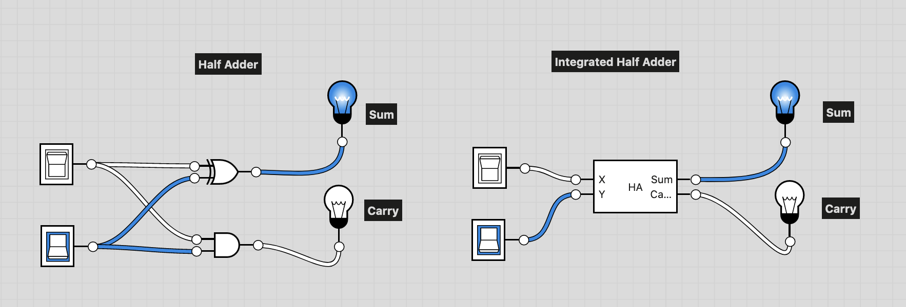

# Half Adder Definition:
```
Computes the sum of two bits.
```

## Truth table
Here we are simply adding two 1-bit numbers. We need to output the sum and the carry.
The truth table then would be:

|a|b|carry|sum|
|-|-|-|-|
|0|0|0|0|
|0|1|0|1|
|1|0|0|1|
|1|1|1|0|

## Implementation
Thus, according to our truth table above:
- To output the sum, you would use an XOR gate
- To output the carry, you would use an AND gate
- **Done** - File is `HalfAdder.hdl`

## Image
- Here is the Half Adder showing all the different states.


- Here is an integrated version. Note, `x` and `y` are actually `a` and `b`, I wasn't sure if I could label  them a and b and not cause a conflict when building the full adder


