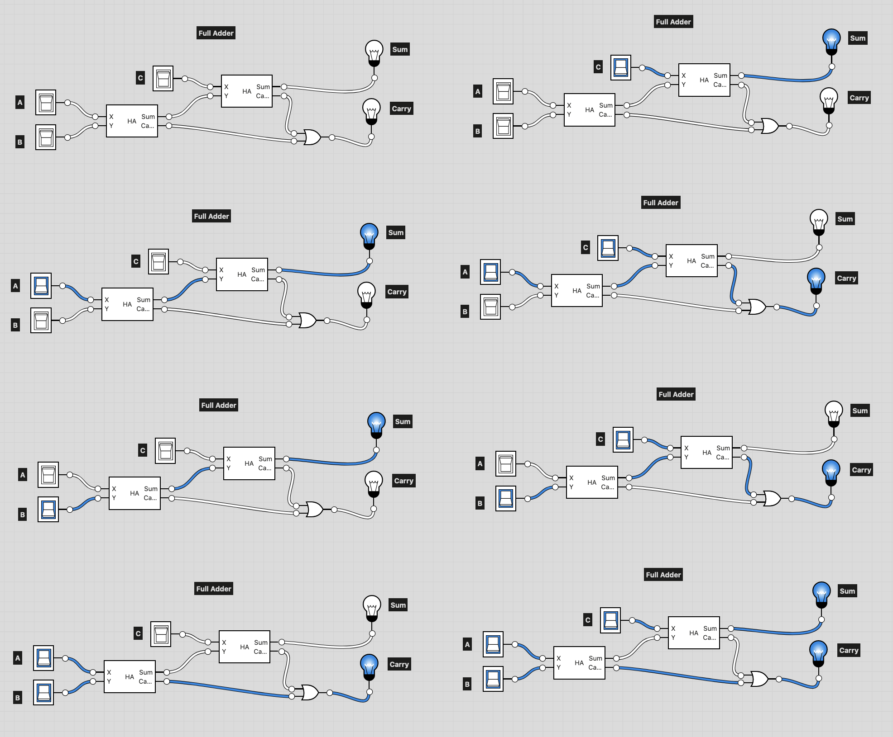
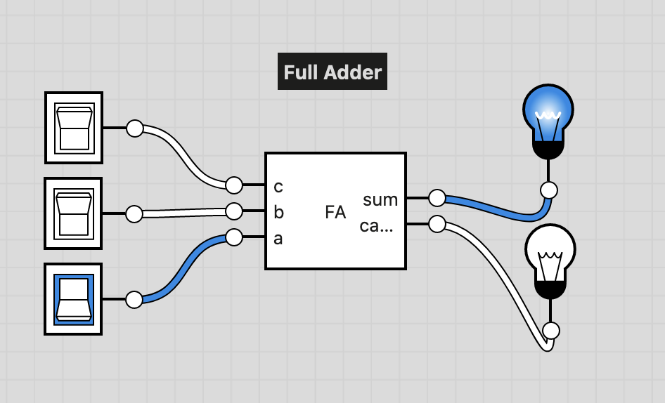

# Full Adder Definition:
```
Computes the sum of three bits.
```

## Truth table
Here we are adding three 1-bit numbers. We need to output the sum and the carry.

The truth table then would be:

|a|b|c|carry|sum|
|-|-|-|-|-|
|0|0|0|0|0|
|0|0|1|0|1|
|0|1|0|0|1|
|0|1|1|1|0|
|1|0|0|0|1|
|1|0|1|1|0|
|1|1|0|1|0|
|1|1|1|1|1|

## Implementation
Thus, according to our truth table above, and using our half adders:
- To output the sum, you would use one half adder to add `a` and `b`, then take that sum, and use it as input into a second half adder, along with `c` to get the sum.
- To output the carry, it got a little tricky. Basically, the carry must be 0 or 1, and it depends on the order of operations. Say for a and b, you had 0 and 1 respectively, the carry would be zero, so when adding 1 as c, you would still have a value of 0 if you plugged the wiring carrys the same as we did for the sum. In the end, if there is a carry for `a + b`, or one from adding `(a+b) + c`, you would end up with a carry. If you draw out all the combinations, you'll see that if:

- `(a + b)` is 0 and `c` is 0, the carry is 0
- `(a + b)` is 0 and `c` is 1, the carry is 1
- `(a + b)` is 1 and `c` is 0, the carry is 1
- `(a + b)` is 1 and `c` is 1, the carry is 1

The above is a truth table for OR, so you need to OR the two carry's from the half adders.

- **Done** - File is `FullAdder.hdl`

## Image
- Here is the Full Adder showing all the different states.



- An integrated version of the Full Adder.


