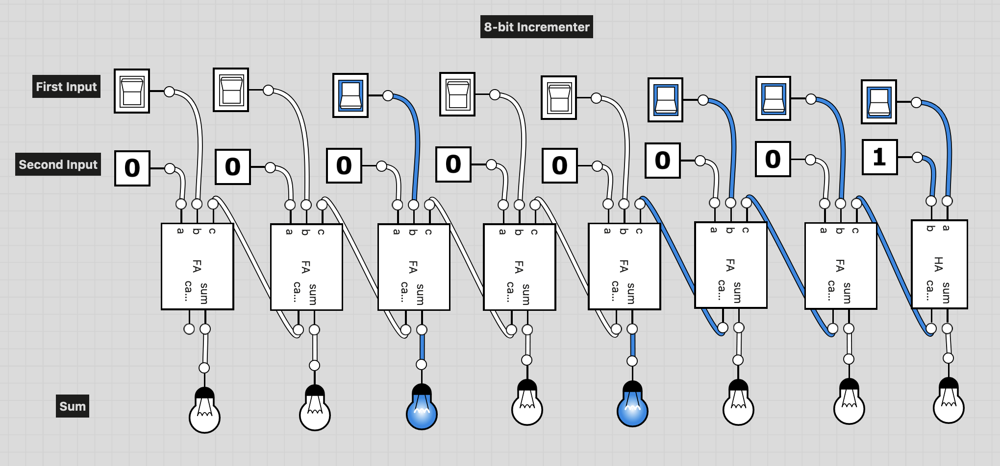

# Add 16 Definition:
```
Adds two 16-bit values.
The most significant carry bit is ignored.
```

## Implementation
Here we want to add two 16-bit numbers.
- To start off, I chose a half adder to start on the least significant bit.
- From there, I used full adders for the remaining bits.
- The sums for each are sent out directly.
- The carry's however, are sent as the `c` input immediately to what would be the "left".

- **Done** - File is `Add16.hdl`

## Image
- Top: A single FullAdder integrated chip
- Bottom: An 8-bit version of an Add chip


# Incrementer Definition
```
16-bit incrementer:
out = in + 1 (arithmetic addition)
```
## Implementation
We can do the operation with an Add16 chip, and use `0000000000000001` as one of the inputs. To make a dedicated chip, we can use the same structure as the Add16 chip, and use True for the LSB and False for the remaining.

- **Done** - File is `Inc16.hdl`

## Image
- Example of an 8-bit incrementer


