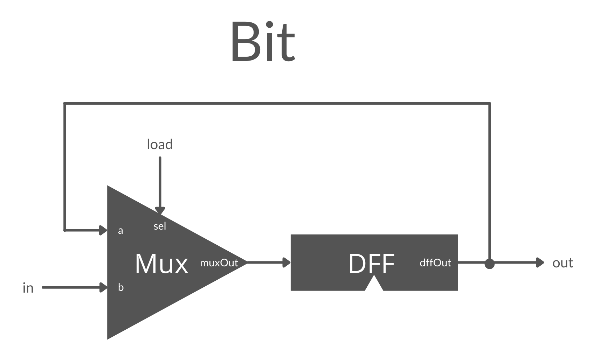

# Bit Definition:
```
 1-bit register:
 If load[t] == 1 then out[t+1] = in[t]
                 else out does not change (out[t+1] = out[t])
```

## Discussion
Here, we are supplied a DFF chip. It will continue to emit whatever its previous input was during each clock cycle. For the Bit chip, we want to be able to either emit the previous state (0 or 1), or be able to load in a new value.

## Implemntation
This one had a diagram in the book, but it was kind of intuitive. You would use a Mux gate, having one input be a new input value, and the other input be the output of a downstream DFF chip. The load for the Mux gate is just a 0 or 1. Out for Bit is the Out from the DFF chip.
**File** is saved as `Bit.hdl`

## Image
- Here is a 1-bit register:


