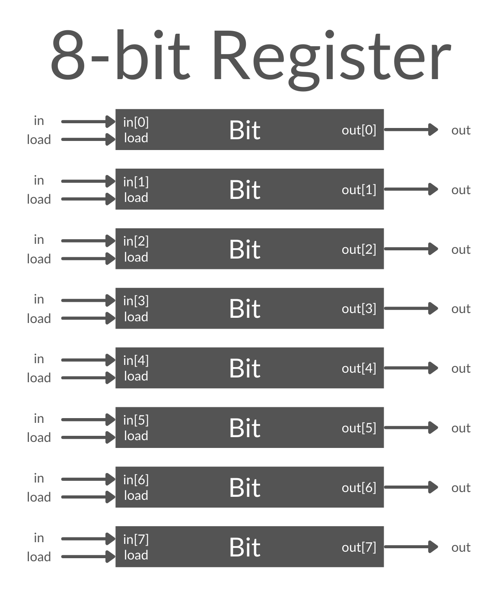

# Register Definition:
```
16-bit register:
If load[t] == 1 then out[t+1] = in[t]
else out does not change
```

## Discussion
Basically, for a register on n-size, we use a bank of 1-bit registers and wrap them up into a chip.

## Implementation
For this chip, we use 16 Bit Registers.
- **File** is `Bit.hdl`

## Image
- Here is an example of an 8-bit register, you would have 16 total 1-bit registers for this exercise.


