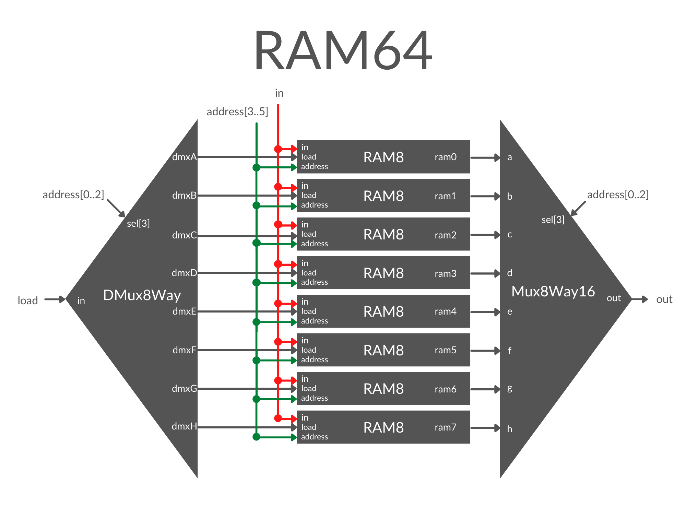

# RAM64 Definition:
```
Memory of 64 registers, each 16 bit-wide. Out holds the value
stored at the memory location specified by address. If load==1, then
the in value is loaded into the memory location specified by address
(the loaded value will be emitted to out from the next time step onward).
```

## Discussion and Implementation
For the 64 register RAM unit, we basically somewhat repeat what we did for RAM8, except that, now instead of sandwiching a set of 16-bit Registers between multiway DMux and Mux chips, we sandwich a bank of RAM8 units.

There is one major difference here though, we must address both the registers within the RAM8 units, and address the RAM8 units. Luckily, we can split the 6-bit address in two halves to do this. Therefore, we use the first 3 most significant bits of the address for the DMux/Mux pair to target the RAM8 units. Then use the remaining least significant bits to target the Registers within the RAM8 chips.

Again, the input will be sent to all Registers within the RAM64 chip, and only one 1-bit Register will receive the load instruction.

- **File** is `RAM16.hdl`

## Remaining RAM chips.
This same design is repeated to build subsequent RAM chips.

## Image
- Pictured is a RAM64 unit:


