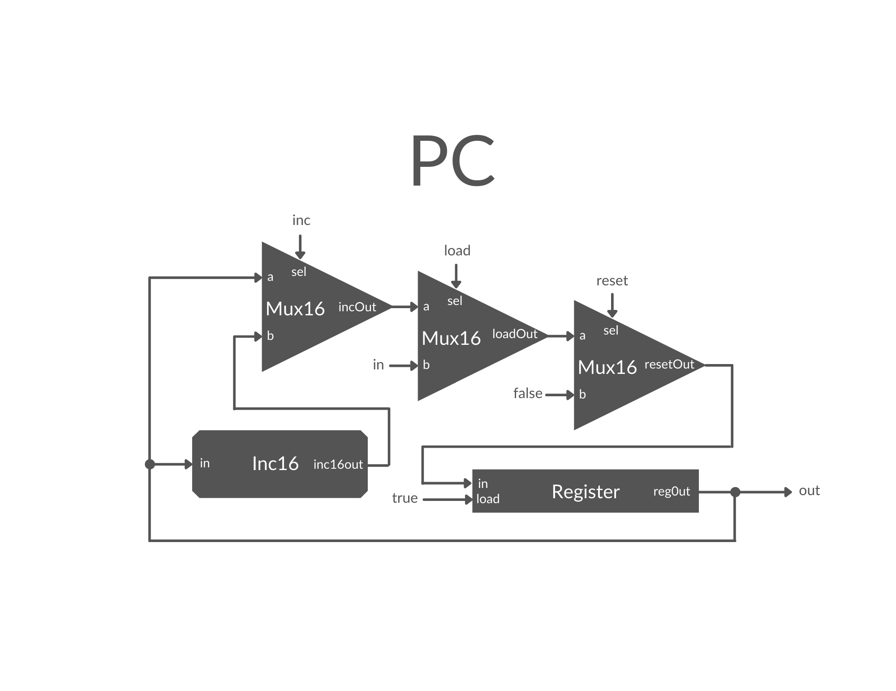

# PC Definition:
```
A 16-bit counter with load and reset control bits.
if      (reset[t] == 1) out[t+1] = 0
else if (load[t] == 1)  out[t+1] = in[t]
else if (inc[t] == 1)   out[t+1] = out[t] + 1  (integer addition)
else                    out[t+1] = out[t]
```

## Discussion
The PC chip is one that increments a 16-bit value, similar to Inc16. However, it has additional features, such as a reset setting the bits to zero (reset), the ability to reset to a specific value (load), or to continue emitting the previous value.

## Implementation
There was multiple feedback for this one, so it was a little "bit" of a challenge:
- I used a `Register` to hold the values, and to continually emit, I set the load to `true`.
- To do the increment, I used the `Inc16` chip.
- From there, it's a cascade of `Mux16` chips to deal with the specification. Originally, I had them backwards, haha. But figured it out.
- The "load" `Mux16` chip is used to take in the `in`. The `Register` handles the final out. However, the `Resister` also has it's out split such that it provides the input for the `Inc16` chip and the "inc" `Mux16` chip. For the "inc" `Mux16`, the `sel` determines if we will take an incremented value or the original value from the `Register`. Finally, the "reset" `Mux16` handles resetting the `Register` to zero via a `false` input on it's `b` input.
- **File** is `PC.hdl`

## Image
- Pictured is a PC chip:


